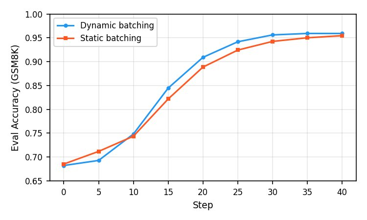

# Training

This page is the practical guide to the training loops the cookbook uses —
both **RL** (the math, tool, and code recipes) and **SFT** (tulu3_sft). They
share SDK adapters and artifact conventions but use different loops: RL learns
from sampled trajectories and rewards; SFT learns from labeled token targets.
For the
bigger-picture client-vs-service philosophy, see [concepts.md](./concepts.md).

## The train loop (pseudocode)

The snippets below are **pseudocode** — they show the shape of the loop, not
something you can copy-paste and run. Stripped to its essentials, the RL loop
looks approximately like this:

```python
# 1. Create an Azure AI Fine-Tuning Session (loads model on the service side)
# client is the async SDK client; this pseudocode is inside an async function.
session_id = await client.create_session(**experiment_params)
training_client = AzureSDKTrainingClient(client, session_id, tokenizer)

for step in range(num_steps):
    # 2. Sync weights to the sampler and get a sampling client
    sampling_client = await training_client.save_weights_and_get_sampling_client_async()

    # 3. SAMPLE — generate group_size completions for each of groups_per_batch prompts
    completions = await sampling_client.sample_async(prompt, num_samples=group_size, sampling_params=...)

    # 4. GRADE — compute rewards (client-side, you own this logic)
    rewards = grade(completions, ground_truth_answers)

    # 5. COMPUTE ADVANTAGES — default group-mean baseline, no std division
    advantages = rewards - group_mean

    # 6. FORWARD_BACKWARD — send data to the service
    forward = await training_client.forward_backward_async(batch, loss_fn="importance_sampling")
    await forward.result_async()

    # 7. OPTIM_STEP — update weights on the service
    optimizer = await training_client.optim_step_async(adam_params)
    await optimizer.result_async()
```

Steps 3, 6, and 7 run on service GPUs (inference and training respectively). Steps 4 and 5 run locally on your laptop or VM.

The default [advantage implementation](../interactive_training/rl/data_processing.py) subtracts the group mean; it does **not** divide by group standard deviation. Custom strategies and optional KL/token shaping can alter the final per-token advantages. Keep reward scaling and the selected strategy fixed when comparing runs.

### What changes for SFT

SFT collapses steps 2–5. Instead of sampling completions and grading them, you
read pre-labeled chat rows from a dataset, tokenize them, and apply a per-token
loss mask so gradients only flow through assistant content:

```python
for step in range(num_steps):
    # 2'. Load and tokenize a pre-labeled batch (no sampling, no grading)
    batch = tokenize_with_loss_mask(dataset.next_batch(batch_size), renderer)

    # 6. FORWARD_BACKWARD with cross_entropy loss
    forward = await training_client.forward_backward_async(batch, loss_fn="cross_entropy")
    await forward.result_async()

    # 7. OPTIM_STEP
    optimizer = await training_client.optim_step_async(adam_params)
    await optimizer.result_async()
```

The update primitives in steps 6 and 7 are shared with RL. SFT does not sample
training targets or sync before every step, although the current shared loop
does an initial ephemeral sampler warm-up and persists sampler weights at
checkpoint boundaries. Advantages are replaced by the
cross-entropy loss mask the renderer emits, and the held-out eval reports
`test/nll` instead of `test/env/all/correct`.

## Tunable parameters

These are common training knobs. Defaults and CLI exposure vary by recipe; use
the selected entrypoint's `--help` rather than treating the table as a universal
CLI contract. Shared text recipes default to `Qwen/Qwen3.8-27B`; use
`qwen3_8_low_reasoning` (the automatic selection) for low-effort reasoning.
Explicit `qwen3_8` retains `xhigh`, `qwen3_8_medium_reasoning` selects medium,
and `qwen3_8_disable_thinking` disables thinking. Changing the renderer does not
change `max_tokens`; reasoning and the final answer share that completion budget.
Specialized NER and foundational tool-use examples keep their explicit
non-thinking preference rather than inheriting this general default.

The defaults below are from **math Azure `CLIConfig`** and **Tulu3 Azure `CLIConfig`**, not suggested settings for every task. The bounded [quickstart](./quickstart.md#6-run-the-bounded-remote-workflow) explicitly overrides math's arithmetic-oriented defaults.

| Parameter | Math Azure default | Tulu3 Azure default | Meaning / decision |
|---|---|---|---|
| `lora_rank` | `16` | `16` | Adapter rank; capacity and memory trade-off. Match it when restoring a checkpoint; higher is not a quality guarantee. |
| `learning_rate` | `1e-5` | `5e-4` | Adam step size; tune against held-out metrics and instability, not another recipe's default. |
| `max_tokens` | `5` | Not a training-target parameter | **Generated completion** budget, including reasoning. Five tokens is for toy arithmetic; explicitly choose a larger budget for GSM8K/math and monitor truncation. |
| `temperature` | `1.0` | Not a training-target parameter | Sampling diversity. Record it for comparisons; a model-specific quality claim requires evaluation. |
| `group_size` | `4` | Not applicable | Completions per training prompt; increases rollout cost and changes advantage estimates. |
| `groups_per_batch` | `100` | Not applicable | Prompts per RL iteration; smaller examples are easier to inspect. |
| `max_length` | Not applicable | `16384` | **Rendered sequence** budget, not output length. Tulu3 truncates to this budget; its current builder does not forward the fail-fast/context fields ([limitation](../interactive_training/recipes/tulu3_sft/README.md#sft-on-tulu3)). |
| `batch_size` | Not applicable | `128` | SFT rows per full batch. Floor batching can omit tail rows or yield no batches; see [custom data](./custom-data.md#2-render-and-inspect-locally). |
| `num_epochs` | One dataset traversal | `1` | Dataset passes; choose using validation rather than a universal epoch recommendation. |
| `lr_schedule` | Constant recipe learning rate | `linear` | SFT schedule supports `linear`, `cosine`, or `constant`; a step cap does not redefine its full-dataset schedule denominator. |
| `eval_every` / `save_every` | `20` / `20` | `500` / `500` | Iteration/step cadence; see [cadence](#eval-and-checkpoint-cadence). |
| `max_steps` | `None` | `None` | Set a small **positive** cap for a paid smoke run. SFT zero disables the cap; math zero still allocates a session, not an offline/eval-only mode. |
| `max_train_examples` / `max_test_examples` | `None` / `None` | `None` / `None` | Limit dataset scope as well as iterations. These do not bound session loading or total cost. |
| `max_wall_clock_seconds` | `None` | `None` | Loop-boundary budget, not a hard request/loading timeout or price cap. |

Model/service context and capacity limits are separate from these client settings. Do not treat a historical 16k-token experiment as a universal service ceiling. Programmatic console controls are described [below](#console-logging-verbosity); the math/Tulu3 CLIs do not expose them.

## Handling truncated rollouts (RL)

When `max_tokens` is tight relative to a model's natural reasoning length, a
chunk of every batch will hit the cap mid-thought and return no parseable
answer. Those rollouts are graded as wrong even when the reasoning was on
track, which adds noise to the reward signal and slows learning.

**Before reaching for any of the options below, check whether you need
thinking at all.** A model-compatible non-thinking renderer can reduce generated
tokens, but its accuracy and latency trade-off must be measured on your own
held-out task. Do not treat results from a different model or dataset as a
Qwen3.8 benchmark. The remaining options assume thinking is useful for your task.

Historical internal measurement on DeepMath-103K with **Qwen3.5-27B**:
full-think at 16k tokens reached 79%, while no-think at ~300 tokens reached
77.5%. These original model/results are retained for reference, not as evidence
of Qwen3.8 quality or a general guarantee about disabling thinking.

If you do need thinking, options roughly from cheapest to most invasive:

- **Tell the model to be terse.** The simplest lever. Add a brevity hint to
  the prompt ("Solve as concisely as possible; skip restating the problem")
  or strip pleasantries down to caveman-style instructions
  ("solve. box answer."; see [JuliusBrussee/caveman](https://github.com/JuliusBrussee/caveman)
  for an example). It needs no new training data, but generated tokens and
  accuracy can change; measure both on the same held-out comparison.

- **SFT on trimmed CoTs.** If you have (or can generate) chain-of-thought
  traces with appropriate usage rights, curate shorter, correct responses
  that preserve the final answer before SFT/RL. Blind tail truncation can
  remove the answer and its loss tokens. This changes the data and training
  objective; it is not a documentation-only fix or a guaranteed quality win.

- **Budget forcing (s1-style).** Opt-in, no extra data needed. When a
  first response has no parseable `\boxed{}` answer, the math env
  opens a short turn 2 with an explicit instruction to commit based on
  whatever reasoning the model has so far. The trigger is a missing parsed
  answer, **not an exact token-cap test**. This adds a sampling call for
  affected rollouts; any recovery/quality gain must be measured. Inspired by
  [Muennighoff et al., 2025](https://arxiv.org/abs/2501.19393).

  The cookbook ships a **reference implementation** on the math recipe
  ([`MathEnv` in `interactive_training/recipes/math_rl/math_env.py`](../interactive_training/recipes/math_rl/math_env.py))
  wired through to the `math`, `deepmath`, and `gsm8k` dataset builders.
  Other recipes (`tool_rl`, `code_rl`, etc.) don't have it out of the box —
  treat `MathEnv` as the pattern to copy if you want budget forcing in
  your own env: store the knobs on the env, detect a missing parseable
  boxed answer in `step()`, and return a `StepResult` with
  `next_max_tokens` set to your turn-2 budget plus a re-rendered prompt
  that asks the model to commit.

  CLI knobs on the math recipe (all default to no-op):

  | Parameter | Default | Guidance |
  |-----------|---------|----------|
  | `forced_commit` | `False` | Master toggle. |
  | `forced_commit_max_tokens` | `1024` | Budget for the turn-2 generation. For a successful two-turn rollout, the configured generated-token allowances sum to `max_tokens + forced_commit_max_tokens`; this is not a total token/cost cap including prompts, retries, or model loading. |
  | `forced_commit_prefill_boxed` | `False` | Prefill `</think>\n\n\boxed{` to guide answer completion. It does not guarantee valid syntax or a particular budget reduction. Renderer must accept `prefill=` on `build_generation_prompt` (Qwen3-family does). |
  | `forced_commit_penalty` | `0.0` | Reward penalty applied when the answer came from the forced-commit turn. Set to a small positive value (e.g. `0.2`) to make the policy prefer answering on turn 1 — useful if you want to deploy the model with a single sampling call and not pay the recovery overhead at inference. `0.0` keeps the recovery purely as a training-time correction. |

## Loss functions

Pass via `loss_fn=<name>` on the CLI. All are computed server-side from the token-level data you send via `forward_backward`.

- `importance_sampling` — GRPO-style off-policy correction; the default for RL recipes.
- `ppo` — clipped surrogate objective.
- `cispo` — clipped importance sampling, a stabilized variant.
- `sapo` — Soft Adaptive Policy Optimization; a smooth sigmoid gate on the IS ratio with separate positive/negative advantage temperatures.
- `cross_entropy` — supervised loss over token labels; **the default for SFT** and also useful for SFT-style steps mixed into RL.

For the per-loss wire format (which `loss_fn_inputs` keys each one requires) and for writing your own loss via `forward_backward_custom` (DPO, distillation, regularizers), see [loss_functions.md](./loss_functions.md).

## Data format and loss masking

`forward_backward` takes a `list[Datum]`. A `Datum` carries input tokens plus a `loss_fn_inputs` dict of per-token tensors:

```python
Datum(
    model_input=ModelInput(chunks=[ModelInputChunk(tokens=[...])]),
    loss_fn_inputs={
        "target_tokens": TensorData(data=[...]),  # input tokens shifted left by one
        # ... loss-specific keys: weights (SFT) or advantages + logprobs (RL)
    },
)
```

See [sdk-reference.md § Types](./sdk-reference.md#datum-modelinput-tensordata) for the typed-API view. Which extra keys are required depends on the loss function — and that's also where per-token masking lives.

### SFT: per-token `weights`

`cross_entropy` adds a **`weights`** key, the same length as `target_tokens`: 1.0 to train on that position, 0.0 to ignore it. The loss is `-(weights * log_p(target)).sum()`.

The weights come from the **renderer** — the component that turns `Message` objects into tokens. Renderers ship per chat format in [`interactive_training/renderers/`](../interactive_training/renderers/) (`qwen3`, `gpt_oss`, `deepseek_v3`, …) and the cookbook's SFT pipeline calls into them to produce a `Datum` directly.

Which tokens get weight 1.0 is controlled by the **`train_on_what`** knob (a `TrainOnWhat` enum defined alongside the renderers):

| Value | Trains on |
|-------|-----------|
| `last_assistant_message` (default) | The last assistant message only. |
| `last_assistant_turn` | All assistant content after the last user message; an explicit alternative, not the Tulu3 builder default. |
| `all_assistant_messages` | Every assistant message; verify renderer prefix compatibility before using it for earlier turns. |
| `all_messages` | Everything except role headers. |
| `all_tokens` | Everything, including role headers. |
| `all_user_and_system_messages` | The inverse — user/system only (distillation). |
| `customized` | Per-message `trainable: bool` on each input message. |

Defaults also depend on the builder: Tulu3 falls back to `LAST_ASSISTANT_MESSAGE`; `FromConversationFileBuilder` falls back to `ALL_ASSISTANT_MESSAGES` unless explicitly configured. The [custom-data example](./custom-data.md#2-render-and-inspect-locally) selects `LAST_ASSISTANT_MESSAGE` for its single-response rows and explains the Qwen3.8 earlier-turn prefix limitation.

### RL: implicit masking via `advantages`

RL doesn't use `weights`. The cookbook RL pipeline ([`interactive_training/rl/`](../interactive_training/rl/)) walks each sampled trajectory and emits a `Datum` with:

```python
loss_fn_inputs={
    "target_tokens": TensorData(data=...),
    "logprobs":      TensorData(data=...),  # sampler logprobs, for off-policy correction
    "advantages":    TensorData(data=...),  # 0 at obs positions, traj_advantage at sampled tokens
}
```

In the default importance-sampling path, the mask is **folded into `advantages`**: observation tokens (system prompt, user message, tool results returned to the model) get `0`; sampled tokens get the group-relative `traj_advantage`. For that objective, zero-advantage positions contribute zero gradient. Optional KL/token shaping or a custom loss can change the sampled-token weights; the client also retains a separate action `mask` for diagnostics.

**Consequences for multi-turn recipes (`tool_rl`, `code_rl`):**

- Without optional token shaping or a custom loss, sampled assistant tokens share the trajectory advantage — prose, `<tool_call>` markers, JSON arguments, Harmony channels for gpt-oss, final answer. The model learns its own tool-call syntax.
- Tool results are masked out: they re-enter as the next transition's observation, so they get `advantages=0`.
- `train_on_what` has no effect — renderers are used in RL only for prompt construction and for parsing tool calls back out of sampled tokens.

To weight sampled-token categories differently (e.g. zero out JSON args inside `<tool_call>`), you'd modify the trajectory-to-`Datum` step in [`interactive_training/rl/`](../interactive_training/rl/) to emit a custom `advantages` vector — there's no CLI knob for this.

## Dynamic sampling (RL-only, experimental)

> **Status:** experimental and **off by default** (`dynamic_sampling=False`) — behavior may change or be removed in future releases. RL-only; currently implemented only for sync RL.

When `remove_constant_reward_groups=True`, the training loop discards prompt groups where every completion received the same reward (the model already "knows" or completely fails that problem — no gradient signal). This is standard GRPO **online filtering** and works well, but it shrinks the effective batch size unpredictably as the model improves.

**Dynamic sampling** (`dynamic_sampling=True`) extends online filtering by automatically sampling additional prompt batches until the target `groups_per_batch` post-filter groups are collected. This is the "Dynamic Sampling" technique you see in e.g. the [DAPO paper](https://arxiv.org/abs/2503.14476) (Algorithm 1, steps 2-7).

### How it works

1. Sample a batch of prompts and generate completions.
2. Filter out constant-reward groups.
3. If fewer than `groups_per_batch` valid groups remain, pull the next batch of prompts from the dataset and repeat.
4. Stop when the batch is full **or** `max_oversample_rounds` rounds have been reached.
5. Excess valid groups carry over to the next step. Checkpoint cursor bookkeeping lets recovery revisit unconsumed prompts; it does not persist every sampled completion or guarantee identical replay.

The dataset cursor (`prompt_cursor`) is independent of the training step counter, so the model sees fresh prompts each round rather than re-sampling the same batch.

### Configuration and CLI exposure

| Parameter | Shared RL `Config` default | Math Azure CLI | Guidance |
|---|---|---|---|
| `dynamic_sampling` | `False` | Exposed, default `False` | Master toggle; implies constant-reward filtering. |
| `max_oversample_rounds` | `3` | Exposed, default **`10`** | Bound additional dataset batches; measure rollout cost and filter rate. |
| `oversample_cushion` | `1.2` | **Not exposed** | Programmatic top-up safety multiplier; do not pass it to the math CLI. |
| `remove_constant_reward_groups` | `False` | **Not exposed** | Programmatic standalone filtering; dynamic sampling enables filtering internally. |

After the first round, the loop sizes top-up sampling using the observed filter rate and `oversample_cushion`. How many rounds are needed depends on the dataset/policy; monitor the actual rounds and rollout count.

### CLI usage

```bash
python -m interactive_training.recipes.math_rl.train_azure \
    ... \
    dynamic_sampling=True \
    max_oversample_rounds=3 \
    max_steps=2
```

  This is a fragment to add to a complete math command within the requested run's scope, with endpoint, dataset, token budget, and run path; `...` is not a literal argument. It does not add `oversample_cushion` to the launcher.

### When to use it

- Your filter rate is high (>30% of groups are constant-reward) and you want consistent effective batch sizes.
- You're training on a dataset with easy problems the model quickly masters.



GSM8K on Qwen3-32B with `max_tokens=1200` (the cap at the time of this experiment) — at this max length, RL is mainly teaching the model brevity rather than new reasoning. In early training, dynamic batching yields clear per-step efficiency gains by ensuring every group contributes a non-zero gradient. The extra rollouts needed to fill each batch do make wall-clock time per step longer, so the net compute trade-off depends on your filter rate.

In this run, reaching step 40 took **~11.5 h with dynamic batching** vs **~6.4 h with static batching** — dynamic gets there in fewer steps but burns more rollouts per step (avg ~3 oversample rounds at ~64% filter rate). Treat `max_oversample_rounds` and `oversample_cushion` as knobs you need to tune for your dataset: tighten them once you've measured your filter rate to avoid wasted rollouts. This is an experimental feature and we expect the compute trade-off to improve as we tune it.

### Metrics

When enabled, the following metrics are logged per step:

| Metric | Meaning |
|--------|---------|
| `dynamic_sampling/rounds` | How many sampling rounds were needed |
| `dynamic_sampling/valid_groups` | Groups that passed filtering |
| `dynamic_sampling/total_groups_sampled` | Total groups sampled across all rounds |
| `dynamic_sampling/filtered_groups` | Groups discarded (constant reward) |
| `dynamic_sampling/filter_rate` | Fraction filtered; inspect all-good versus all-bad groups before interpreting it as mastery |
| `dynamic_sampling/carryover_in` / `carryover_out` | Valid prompts inherited from / passed to the next step |
| `dynamic_sampling/prompt_cursor` | Current position in the dataset |

## Custom batching strategies (RL-only, experimental)

> **Status:** experimental and **opt-in** (`strategy=None` by default) — the API may change. RL-only. When unset, the training loop is unchanged.

Dynamic sampling above is one hard-wired policy. The **dynamic-batching strategy** API instead hands you the batch-construction step itself: a strategy decides, per prompt group, **how many** rollouts to keep or re-roll and **which** of them actually train — set via a single config field, with no changes to the training loop. The point is range of control: the same two primitives express everything from a no-op to the published algorithms below, so you can prototype your own batching idea without forking the loop.

Every policy factors into two small primitives on `DynamicBatchStrategy`:

- **`allocate(group) → MORE | DROP | ADMIT`** (the *roll* axis) — grow this group's rollout pool (`MORE`), discard the group (`DROP`), or take it as-is (`ADMIT`). `MORE` re-rolls are opt-in via `max_rolls_per_group`; a dropped group can auto-refill the batch with `refill_on_drop=True` so the batch stays full.
- **`select(batch) → per-group kept indices + weights + advantages`** (the *train* axis) — keep an informative subset of each group and reweight it.

### Built-in strategies

These ship as **example implementations** — a few published algorithms expressed on the two primitives to show the range the API covers. They're a menu to use directly *and* a template for your own; the papers are illustrative, not a fixed set.

| `strategy=` | Example paper | What it does |
|-------------|-------|--------------|
| `fixed` | GRPO (baseline) | keep every rollout (identity) |
| `dapo` | [DAPO](https://arxiv.org/abs/2503.14476) | drop constant-reward (zero-gradient) groups |
| `pods` | [PODS](https://arxiv.org/abs/2504.13818) | down-select each group to its max-variance subset |
| `pilot_commit` | [Pilot-Commit](https://arxiv.org/abs/2605.26606) | re-roll in-band prompts (A-axis MORE), then commit more rollouts |

Enable one from the recipe CLI — the knobs (`pods_keep`, `pilot_rollouts`, `commit_rollouts`, `refill_on_drop`, `max_rolls_per_group`) are all opt-in:

```bash
python -m interactive_training.recipes.math_rl.train_azure \
    ... \
    strategy=pods pods_keep=8                    # train on the 8 most informative of each group
    # or  strategy=dapo refill_on_drop=true       # DAPO drop + refill the batch back to full
    # or  strategy=pilot_commit max_rolls_per_group=16 commit_rollouts=8
```

### Writing your own

Subclass `DynamicBatchStrategy` (or a built-in) and implement the two primitives. The quickest path is to start from `FixedStrategy` — which already provides a correct GRPO `select` — and override only the axis you care about:

```python
from interactive_training.dynamic_batching import Allocation, FixedStrategy

class DropMastered(FixedStrategy):
    """Illustrative heuristic: drop groups with mean reward >= 0.9.
    This is not a proof of mastery or zero variance; mixed rewards can still
    contain a learning signal. Otherwise retain FixedStrategy behavior.
    """

    def allocate(self, group, *, history=None) -> Allocation:
        rewards = group.get_total_rewards()
        return Allocation.DROP if sum(rewards) / len(rewards) >= 0.9 else Allocation.ADMIT
```

The recipe `strategy=<name>` flag only resolves the built-ins (via `build_strategy`); to run a custom class, construct it and set it as the `strategy` field of the training `Config` in your own launcher. The built-in `FixedStrategy` / `PodsStrategy` / `PilotCommitStrategy` (in `interactive_training/dynamic_batching/strategy.py`) are compact, worked `select` / `allocate` examples to copy from.

## Eval and checkpoint cadence

- `eval_every=N` — step-strategy evaluation every N iterations/steps; zero disables that cadence. A held-out dataset/evaluator must exist. Programmatic `eval_strategy="epoch"` (also exposed by math) requires `eval_every=1` and has initial/completed-epoch behavior rather than every-N-steps behavior.
  - **RL** evaluators take a *sampling* client, grade held-out completions, and log task-dependent `test/env/all/correct`, **`test/env/all/reward/total`**, `test/env/all/format`, plus coverage/token metrics. The toy arithmetic builder has no held-out set; GSM8K does. The default evaluator can drop failed groups; read coverage/warnings before claiming improvement.
  - **SFT** evaluators take the *training* client and call `forward_async()` on a held-out batch — a forward pass only, no backward, so it doesn't touch the gradient buffers between training steps. It logs `test/nll` (mean negative log-likelihood over assistant tokens). `forward_async` is the SFT analogue of `sample_async`: both are the read-only "look at the current model" call for their respective modes.
- `save_every=N` — save a checkpoint every N training batches. Checkpoints land in `<log_path>/checkpoints.jsonl` (see [storage.md](./storage.md)) and the underlying weights are referenceable from another run via `load_checkpoint_path` ([continual-fine-tuning.md](./continual-fine-tuning.md)).

**Cadence is loop-specific.** Sync/streaming RL can persist both training and sampler weights on save or step-evaluation boundaries after the starting iteration; intervening refreshes are ephemeral. Async RL has separate sampling/evaluation timing. SFT periodic saves follow `save_every`, not every evaluation boundary, and the current SFT implementation saves `kind="both"` at periodic/final boundaries. Do not infer that every metric row has a durable matching checkpoint.

The fresh synchronous quickstart evaluates starting weights before the first update and final weights after the final save. Baseline/evaluation can share a step label with training metrics; `num_substeps` can issue more than one optimizer update per RL iteration. Use [evaluation and inference](./evaluation-and-inference.md) and the actual ledger to select weights, rather than choosing a checkpoint only from a chart's step number.

## Training Type

Training type determines the capacity and storage used by the training session. It can be passed while calling recipes via CLI e.g. `training_type=GlobalStandard`. Current availability:

| CLI value | Behavior | Availability |
| --- | --- | --- |
| `GlobalStandard` | Uses globally available training capacity and storage. | Available |
| `DatazoneStandard` | Constrains training to the Foundry account's datazone e.g. Datazone training in EastUS2 Foundry account will use the US datazone and in SwedenCentral Foundry account will use the EU datazone. Current datazones are US, EU, and Asia Pacific. | Unavailable |
| `DeveloperTier` | Uses development capacity when the session is eligible for the developer tier. | Unavailable |


## Console logging verbosity

The shared RL `Config` has two **programmatic** controls for human-readable trajectory dumps. They are not universal recipe CLI flags: the current math and Tulu3 Azure launchers do not expose these fields. Check the selected launcher before appending them to a command. SFT uses separate datum logging and the programmatic `sanitize_logs` field.

- `num_groups_to_log=N` — how many trajectory groups to print per step (default `4`). Set `num_groups_to_log=0` to **disable** the console group dumps entirely (this also disables the per-group logtree HTML logging).
- `max_console_lines_per_datum=N` — cap on the colorized lines printed per trajectory (default `200`). Output beyond the cap is elided in the middle with a `... [N lines omitted] ...` marker. Set `max_console_lines_per_datum=0` for **unlimited** output (full token-by-token transcripts).

> Console colorization/printing is offloaded with `asyncio.to_thread` to reduce event-loop blocking, not to guarantee unlimited logging is harmless. The cap affects only **console echo**, not training data or per-group HTML content. Slow output and large artifacts still consume time/disk.

For quieter console output in a programmatic RL launcher, set `num_groups_to_log=1` and `max_console_lines_per_datum=80` on its `Config`. For full console transcripts, set `max_console_lines_per_datum=0`. These are not extra math CLI arguments. Larger content logs can expose private prompts and completions; turning down console output is not a general artifact-redaction policy.

## Resuming after an interruption

If a run dies mid-training — a dropped connection, a Ctrl-C, a preempted box — you can pick up where it left off **by relaunching the exact same command with the same `log_path`**. This is *crash recovery* and is distinct from [continual fine-tuning](./continual-fine-tuning.md): both warm-start the optimizer from the checkpoint, but recovery also restores the **dataset position**, whereas continual FT starts a fresh pass at batch 0.

### How it works

The recipe auto-resumes off the local `<log_path>/checkpoints.jsonl` ledger (see [storage.md](./storage.md#checkpointsjsonl)). On startup it reads the **last** row that has a `state_path` and:

1. Reconstructs the LoRA weights **and optimizer state** (Adam moment buffers) from the server-side training checkpoint that `state_path` points to — the same `from_checkpoint` machinery as continual FT.
2. Restores the **dataset position** (`batch`, and for dynamic sampling the `prompt_cursor`) from that row, so training continues from the next batch rather than restarting at 0. This is the part that's unique to crash recovery.

The directory must first be accepted with `behavior_if_log_dir_exists=resume` (or the interactive prompt). If it has no resumable `state_path`, it does not restore training state. In shared RL checkpoint selection, a resumable local ledger takes precedence over an explicit `load_checkpoint_path`. Tulu3 has a different selection order, so do not combine an unrelated explicit checkpoint with an existing ledger/cursor. Use a new run directory for continual training.

### To make a run recoverable

- **Set `log_path` explicitly** to a stable directory. By default the recipe writes to a *timestamped* directory (e.g. `…/<run_name>-2026-06-14-17-04-01`), and a relaunch gets a new timestamp — so it won't find the previous ledger. Pin it:
  ```bash
  python -m interactive_training.recipes.math_rl.train_azure \
      project_endpoint="<your-project-endpoint>" \
      model_name="Qwen/Qwen3.8-27B" env=gsm8k \
      max_tokens=1200 max_steps=2 max_train_examples=50 max_test_examples=8 \
      eval_every=1 save_every=1 log_path="$HOME/interactive-post-training-runs/my-recoverable-run" \
      learning_rate=2e-5 group_size=8 groups_per_batch=25 loss_fn=importance_sampling seed=42
  ```
- **Keep `save_every` (and/or `eval_every`) reasonable.** Recovery is only as recent as the last checkpoint boundary — work done since the last save is lost (nothing is autosaved at crash time). Smaller `save_every` = less lost work, more checkpoint overhead.
- **Relaunch the identical command, plus `behavior_if_log_dir_exists=resume`.** Because the `log_path` already exists from the original run, the recipe has to be told what to do with it. The default is `ask`, which **blocks on an interactive prompt** — fatal for an unattended/automated restart. The valid values are:
  - `resume` — keep the directory (and its `checkpoints.jsonl`) and continue. **This is what you want for crash recovery.**
  - `ask` *(default)* — prompt interactively before proceeding.
  - `delete` — **wipe the directory first.** This destroys `checkpoints.jsonl`, so the run starts from scratch — the opposite of resuming. Do not use it when recovering.
  - `raise` — error out if the directory exists.

  With `behavior_if_log_dir_exists=resume`, confirm the reported source matches the actual `state_path` and the loop's resume cursor. Exact log wording and path prefixes vary; do not construct a checkpoint path from an example log line.

Keep the original model, tokenizer, renderer, and LoRA settings on resume. A new
default model does not make older checkpoints compatible with a different base.

Also preserve dataset revision/order, split, seed, and batch/group configuration. The ledger is a cursor, not a complete snapshot of every in-flight async rollout or external tool state; do not promise bit-identical recovery. A run already at its `max_steps` cap will not continue past that cap unless the requested scope includes raising that configured limit. If there is no completed training checkpoint, unsaved optimizer work cannot be recovered from metrics or HTML.

> [!NOTE]
> Resume creates a **new** Azure session initialized from the checkpoint — the new run reports its own `session_id` in `run_meta.json` and stamps `azure.from_checkpoint` with the source. The original session is not reattached.

### Limitations

- **It needs the local ledger and a retained training checkpoint.** If only a session ID survives, discover the actual saved training name/path ([session management](./session-management.md#list-checkpoints-for-a-session)). A compatible retained checkpoint can initialize a fresh run, but the **dataset cursor restarts at batch 0** without the original local state; storage retention must be verified.
- **Selection differs by launcher.** Shared RL gives the existing resumable ledger precedence; Tulu3 checks an explicit path first. Avoid mixing unrelated weights/cursors. For continual training, always use a fresh `log_path`.


## Next

- [storage.md](./storage.md) — where the recipe writes everything
- [dashboard.md](./dashboard.md) — view live metrics in a browser
- [continual-fine-tuning.md](./continual-fine-tuning.md) — keep training from a previous run
- [evaluation-and-inference.md](./evaluation-and-inference.md) — measure quality and use saved weights without inventing a deployment API
